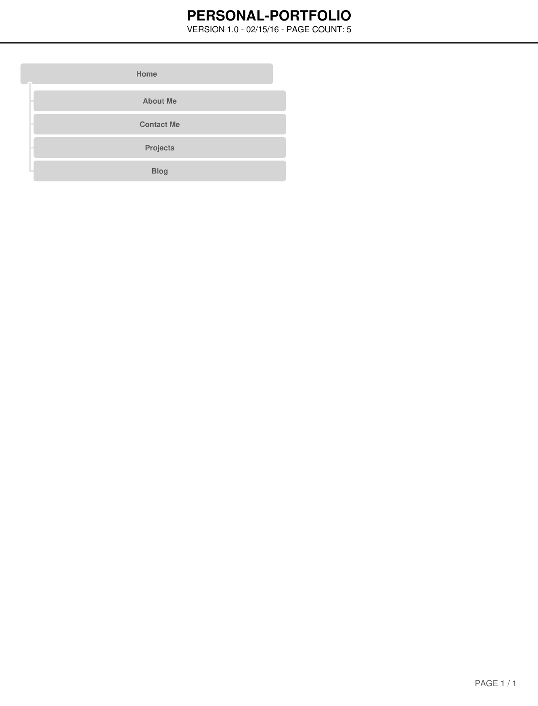

#2.3 Introduction to Design and Site Planning (medium)

##Release 4: Site Map Reflection and Submission

1. What are the 6 Phases of Web Design?

  Information Gathering
  Planning
  Design
  Development
  Testing and Delivery
  Maintenance

2. What is your site's primary goal or purpose? What kind of content will your site feature?

  * Primary Purpose.
    * This site will host my personal portfolio.
    * To market myself to potential employers.
  * Goals
    * Showcase my skills and interest in projects that i am interested in.
    * Get Hired

3. What is your target audience's interests and how do you see your site addressing them?

  * Creating a content strategy without a clear understanding of your audience is a bit like setting a boat adrift without navigational tools. You’re out there and you’re taking action, but you’re not working toward a specific goal.

  * Potential employer interested in hiring Front End/Back End developers.
  Peers to network with

4. What is the primary "action" the user should take when coming to your site? Do you want them to search for information, contact you, or see your portfolio? It's ok to have several actions at once, or different actions for different kinds of visitors.

  * browse my portfolio
  * contact me to discuss about my projects
  * a brief section “About Me” describing about myself.

5. What are the main things someone should know about design and user experience?

  * User Experience
    * User experience (abbreviated as UX) is how a person feels when interfacing with a system. The system could be a website, a web application or desktop software and, in modern contexts, is generally denoted by some form of human-computer interaction (HCI).
  * Design
    * Design principal are based on two things
      * Affordances
        * Affordance is the relationship between an object and a person.
      * Signifier
        * Are communication devices, they tell people what to do and where to do it.

  In terms of good user experiences, *affordances* will tell user where to find my projects on my portfolio e.g. **buttons**

  And *signifiers* e.g. **text on button**, tell users which button will open a projects page and which button will open a blog page.

6. What is user experience design and why is it valuable?

  A good user experience includes a person’s perception of system, such as utility, ease of use. User experience may be considered subjective in nature, such as how they feel. It doesn’t matter what your site or app looks like if people don’t know how to interact with it. And moreover, they need to enjoy that interaction.

7. Which parts of the challenge did you find tedious?

  Deciding what content should go into portfolio.
  How should i arrange things for better user experience.

