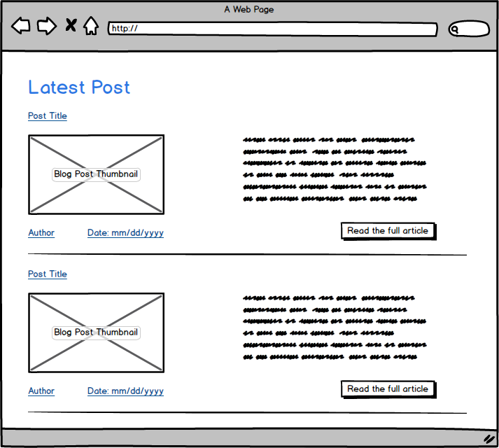

#2.4 Wireframing (medium)

## Release 3: Display your wireframes

## Release 4: Reflect

###In the reflection file you just created, answer the following questions.

1. What is a wireframe?
  * A “wire frame” is a non-graphical layout of the proposed web page .Wireframes are created for the purpose of arranging elements to best accomplish a particular purpose.

2. What are the benefits of wireframing?
  * Wireframes allow project team members and clients to do such things as:
  * Usability.
  * Does the site meets it’s goals
  * Determine web development/programming requirements

3. Did you enjoy wireframing your site?
  * I initially underestimated the challenge in organizing information on my Blog. There were a lot of options that i had to choose from. Every line had to be carefully crafted to enable users to find information and interact with it.

4. Did you revise your wireframe or stick with your first idea?

  * Yes, many times. I had this idea of full blown web-site that i wanted to put on. But the sheer amount of work that goes into putting together a website limited my options. So my site has only the essential components for user to interact with the Blog site.

5. What questions did you ask during this challenge? What resources did you find to help you answer them?

  * Basically i started with 6 phases of web design, but it all boiled down to two question.
    * Primary purpose
    * Goal

6. Which parts of the challenge did you enjoy and which parts did you find tedious?
  * When i started working on wireframe, i had ton of ideas that i wanted include in this first iteration. After a while i realized that may not best work out for me. Due to that i concentrated my efforts to put something out there with basic navigation.
